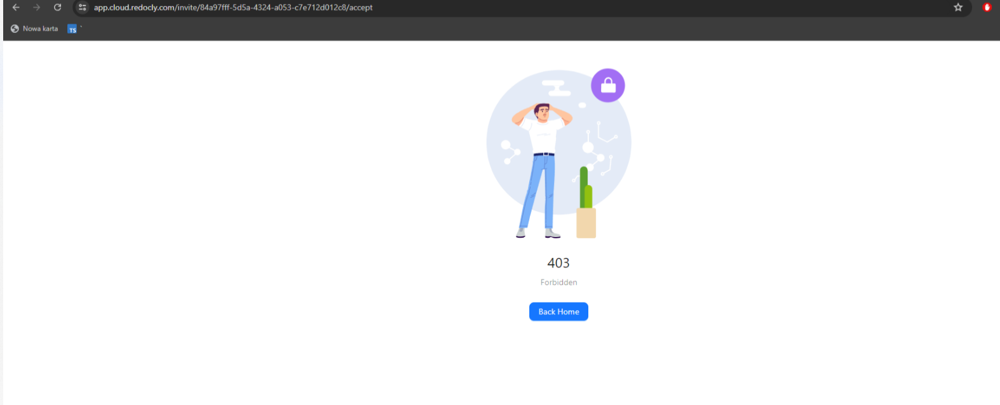

# Training 10 Debrief

Bugs:

- we have the problem with preview
  
- it was weird that checks finished but we still see pending process
  

- Adding logging configuration was a piece of cake. Overall, it works as expected. After adding users as viewers, they were forced to log in first and then redirected to the API webpage.

- Unexpected Use Case: After inviting someone as a viewer, the app crashes and returns a 403 error when the invitation is accepted and the new viewer registers. This occurs because the user does not have access to any organization and was not redirected to the API page during the invitation flow.
- 
