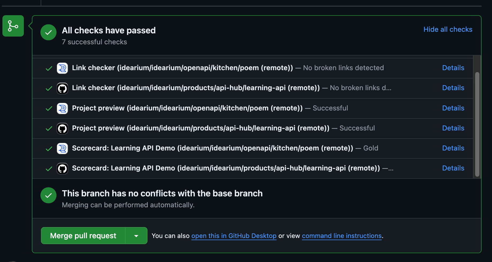
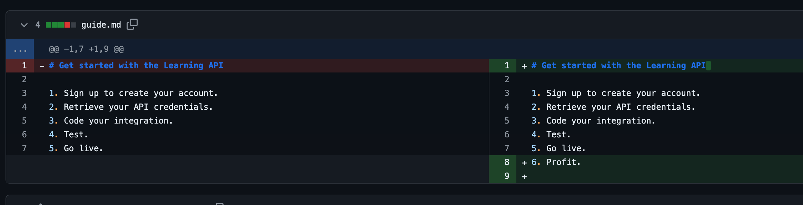

# Training 15 Debrief

## What made you smile?

* We were able to finish this training without looking into the documentation. The information from the right panel was really useful.
* It's a nice feature that we can add specific files and folders.
* PR checks are also good and can prevent bad changes to be pushed.

## Suggestions how to improve UX

### 1 Add tooltips
It would be good for users to explain the difference between **Add Git repository** and **Add from CI/CD**. I would just display a tooltip on hover with the explanation:

* **Add URL link** => Connect a file from a URL.
* **Add Git repository** => Connect the entire repository or a subfolder from a repository where you have access.
* **Add from CI/CD** => Connect partial remote content from a repository where you may not have access, by asking the owner of the repository to specify to which content access should be granted.

### 2. Improve guide on the right side
* We added `REDOCLY_AUTHORIZATION` to variables (as described in the info), but it is supposed to be added to the secrets section. Please also consider providing a path: [Creating configuration variables for a repository](https://docs.github.com/en/actions/writing-workflows/choosing-what-your-workflow-does/variables#creating-configuration-variables-for-a-repository).
* Change Item #5: Commit and push => Commit and push `.github/workflows/push.yaml`.
* Add a final step as a clickable button: Done, you can close this modal window.

## Content protection 🚨
* You can override files or add files without permission to any path in Reunite. It only works if the repo is connected via an external Git provider. In this case, it will not create a PR but pushes changes directly to the main branch.
* We should have a separate env variables for each project to prevent pushing changes to another project or somehow confirm which directories are allowed for pushing.
* 👍 It's good that we do not allow pushing to the root / directory.
* 👍 Content pushed to some folders will not be overwritten (unless file names match, in which case it will).
  
## What did you find confusing?

### 1. Follow a standard GitHub flow change process (good changes)
* Before creating remote content, we created a new branch, but content was pushed directly to the main branch and there wasn't any mention about this behavior. Also, on the new branch, we saw an updated icon but without any content.
* When we added some changes to remote GitHub, the preview didn't reflect the new changes.

### 2. Follow a standard GitHub flow change process (bad changes) 👍

### 3. Follow a non-standard GitHub flow change process 👍

### 4. Follow a non-standard GitHub flow change process:
* When we pushed a broken YAML file directly to the main branch, the deploy was successfully built but not published. It could be hard to find that something is wrong because we didn't see any errors, neither on Reuniter nor on GitHub.
