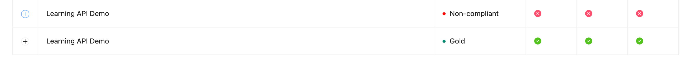

# Training 15 Debrief

## What made you smile?

* We were able to finish this training without looking into the documentation. The information from the right panel was really useful.
* It's a nice feature that we can add specific files and folders.
* PR checks are also good.

## What did you find confusing?

* Why do we see two deploys for each CI/CD update?
* Why do we see two lints, and they could have different statuses?

### 1. Follow a standard GitHub flow change process (good changes)
* Before creating remote content, we created a new branch, but content was pushed directly to the main branch and there wasn't any mention about this behavior. Also, on the new branch, we saw an updated icon but without any content.
* GitHub: We added REDOCLY_AUTHORIZATION to variables (as described in the info), but it is supposed to be added to the secrets section.
* When we added some changes to remote GitHub, the preview didn't reflect the new changes.

### 2. Follow a standard GitHub flow change process (bad changes) 👍

### 3. Follow a non-standard GitHub flow change process 👍

### 4. Follow a non-standard GitHub flow change process:
* When we pushed a broken YAML file directly to the main branch, the deploy was successfully built but not published. It could be hard to find that something is wrong because we didn't see any errors, neither on Reuniter nor on GitHub.
