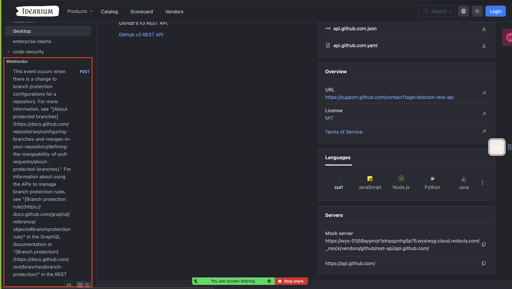

# Training 16 Debrief

## What made you smile?

- We connected GQL docs without using docs. It was intuitive.

## What did you find confusing?

- We have lost uncommitted file during adding remote content
- Webview and whole page basically died when we opened GH REST API. GQL docs were lagging a bit less, but still a lot.
- Broser cannot open deployed [GitHub Rest API](https://idearium.apishowdown.com/vendors/github/rest-api/api.github.com)
- GitHub webhooks looked weird 
- Webview crashed with "heap limit Allocation failed - JavaScript heap out of memory"
