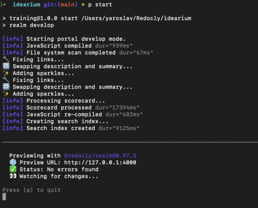
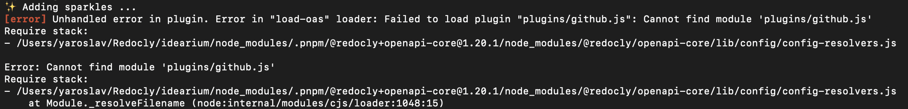

# Training 17.2 Debrief

## What made you smile?

- Finally 🎉, I don't see any error messages about broken links: 
- I realized that decorators are a powerful feature.

## What did you find confusing?

- I asked for help on how to fix the remaining 4 links.
  - I didn't figure out that we can just use `Schema` instead of `SchemaProperties` with this workeround `for (const property of Object.values(target))`.
  - To fix `SchemaProperties` links, they should be defined as `preprocessors` if you use `leave` method. Otherwise, you will continue to see the "4 broken links" message, but in fact, they are not broken. Alternatively, you can use a decorator and the `enter` method (I changed the code to use this approach).
- 📖 It would be good to explain in which case to use leave/enter. In the [sparkle example](https://redocly.com/docs/cli/custom-plugins/custom-decorators#decorator-example), `leave` modifies the content (which is probably wrong), but from the [Visitor pattern](https://redocly.com/docs/cli/custom-plugins/visitor) page, `leave` is used for reporting. As I noticed, `leave` for modifying content is buggy, and `enter` should be used for this purpose.
- 📖 Use ECMAScript modules in examples and not legacy CommonJS
- 📖 TypeScript could be useful for decorator return type, or at least update the docs so we can check parameters.
- 📖 This [API tree node map](https://redocly.com/docs/openapi-visual-reference/openapi-node-types#openapi-3.0-and-3.1-node-type-tree) is outdated or not correct
- 📖 Idea from Andrii T.: Show node type in Reunite editor when your hover over some element
- 🐞 In version 0.97.4: `Failed to load the plugin "plugins/github.js"`. So I decided to stay on 0.97.3. 
- 🐞 API Catalog is not working for another language.
- 🐞 Decorators are not applied for API Catalog. I created a separate `apis` config with `root` pointing to `products/api-hub/petstore.yaml`, and the plugin is not invoked for this API. It also doesn't work if you apply decorators at the top level without `apis`.
- ⚠️ Warning in terminal: `React does not recognize the 'separatorLine' prop on a DOM element`.
- For Revel/Realm, probably we should show that plugins are applied for each language.
- Is it possible to specify the order of plugins? For instance, I want to apply the sparkle decorator only after swapping description and summary.
- How do I debug decorators with Reunite? Should I make a commit and check the preview build logs? Hopefully, I have the ability to run the project locally.
- Maybe it would be good to add an `rs` (restart) option for Realm, similar to what `nodemon` has. For instance, when I change a decorator, I have to quit (`q`) and run `pnpm start` to see logs.

See code snippets









