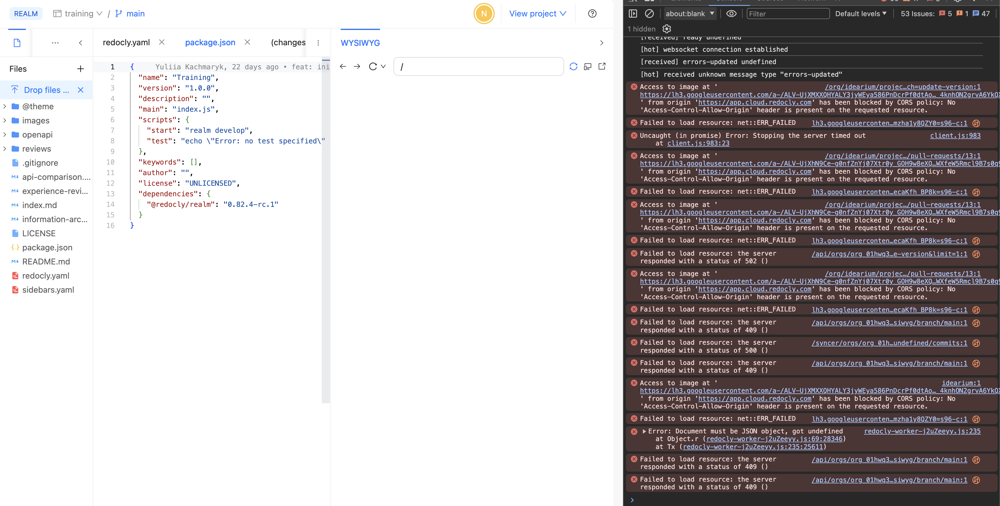
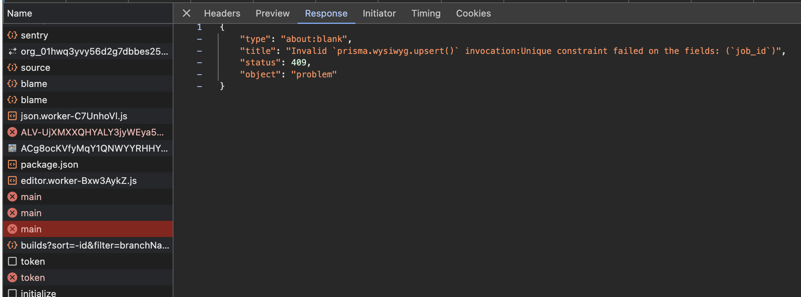

# Training 4 debrief

We started from reverting our previous training steps. 
As we used remote Git repository and created our own one on the first training, it was easy and successfully but we found the error with WYSIWYG (on main branch). See screenshots below:

  > on other branches it works correctly :)

